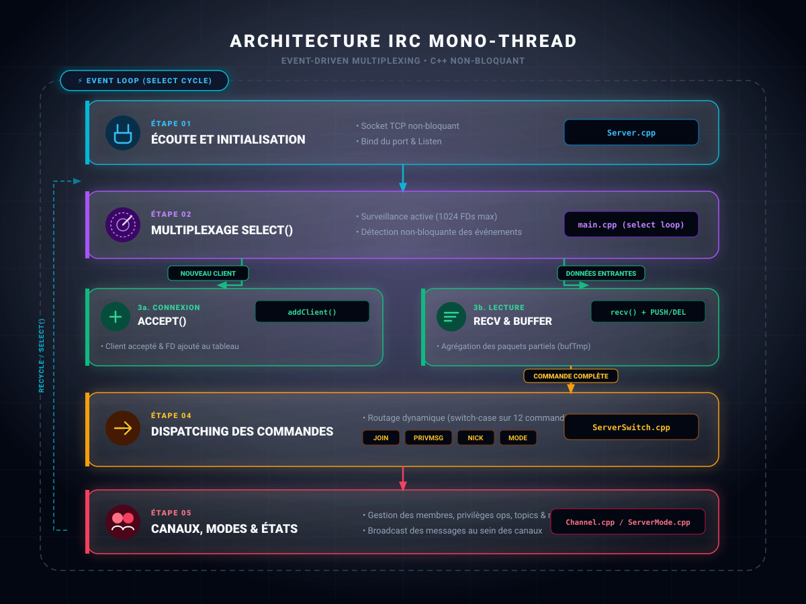

# <span class="h1">ft_irc</span>

<div class="badge-section">
<div class="badge-row">
    
    
    
    
    
</div>
</div>

<p class="intro">
    Implémentation d'un <strong>serveur IRC</strong> en C++ capable de faire communiquer plusieurs clients en local, avec canaux, opérateurs et un bot bonus.
</p>

---

## <span class="h2">Présentation</span>

Un **serveur IRC** qui connecte de **multiples clients** : salons (`#canal`), **opérateurs**, **5 modes** de gestion, **messagerie privée** et diffusion, plus un **bot** Pierre-Papier-Ciseaux.

---

## <span class="h2">Contexte</span>

Projet de la branche réseau du tronc commun 42 : développer un **serveur IRC** (Internet Relay Chat) en C++98 capable de gérer plusieurs clients simultanément, sur le modèle des serveurs IRC réels (RFC 2810 à 2813).

Pas de client à écrire, le serveur doit être compatible avec les clients IRC existants (HexChat, irssi, WeeChat…). Le sujet interdit `fork()` et impose un multiplexage unique (`poll()` ou équivalent comme `select()`) pour toutes les E/S.

---

## <span class="h2">Mon rôle</span>

Projet réalisé **en équipe**. Contributions portant sur la **boucle serveur**, le **dispatch des commandes**, la **gestion des canaux et des opérateurs**, et le **bot bonus** — le tout en C++98 sans bibliothèque externe, avec un Makefile aux règles `all`, `clean`, `fclean`, `re` (sans relink).

---

## <span class="h2">Architecture</span>

Un serveur mono-thread : une boucle `select()` unique surveille tous les descripteurs, accepte les nouveaux clients, lit leurs paquets (avec agrégation des fragments), puis déclenche la commande correspondante.

<figure markdown>
  {.project-architecture}
  <figcaption>Schéma de l'architecture de Ft_irc</figcaption>
</figure>

| Étape | Rôle | Dans le code |
|-------|------|--------------|
| **Écoute** | Création du socket TCP, `bind`, `listen` | constructeur `Server` (`Server.cpp`) |
| **Multiplexage** | Surveillance des sockets prêts à lire | boucle `select(1024, …)` (`main.cpp`) |
| **Accept** | Nouveau client → ajout au tableau de clients | `accept()` + `addClient()` |
| **Lecture** | Réception + agrégation des paquets partiels | `recv()` + `bufTmp(PUSH/DEL)` |
| **Dispatch** | Routage vers la bonne commande | `ServerSwitch.cpp` (switch sur 12 commandes) |
| **Canaux** | Membres, opérateurs, modes, topic | `Channel.cpp` + `ServerMode.cpp` |

---

## <span class="h2">Technologies</span>

<div class="skill-grid">

<div class="skill-card">
    <span class="skill-card-title">Langage</span><br>
    <span class="skill-card-desc"><strong>C++98</strong><br><em>Norme 42, STL (vector, find), aucune bibliothèque externe.</em><br><strong>POO</strong><br><em>Avec classes Server, Client, Channel.</em></span>
</div>

<div class="skill-card">
    <span class="skill-card-title">Réseau</span><br>
    <span class="skill-card-desc"><strong>Sockets BSD TCP/IP</strong><br><em>socket, bind, listen, accept, recv, send, close.</em><br><strong>TCP seul</strong><br><em>Protocole fiable en mode connecté — aucun UDP.</em></span>
</div>

<div class="skill-card">
    <span class="skill-card-title">Multiplexage</span><br>
    <span class="skill-card-desc"><strong>select()</strong><br><em>fd_set + FD_SET, jusqu'à 1024 clients (FD_SETSIZE).</em><br><strong>Sans fork()</strong><br><em>Boucle mono-thread, toutes les E/S dans un seul select().</em></span>
</div>

<div class="skill-card">
    <span class="skill-card-title">Compilation</span><br>
    <span class="skill-card-desc"><strong>Makefile</strong><br><em>Règles all, clean, fclean, re.</em><br><strong>-Wall -Wextra -Werror</strong><br><em>Flags d'erreur stricts, compilation C++98.</em></span>
</div>

</div>

---

## <span class="h2">Fonctionnalités</span>

- **12 commandes** : CAP, PASS, NICK, USER, PRIVMSG, JOIN, KICK, INVITE, TOPIC, MODE, PART, BOT
- Canaux `#` : création, propriétaire, opérateurs (préfixe `@` dans la liste NAMES), topic
- **5 modes de canal** (`MODE`) : `+i` (invitation), `+t` (topic réservé aux opérateurs), `+k` (mot de passe), `+o` (opérateur), `+l` (limite d'utilisateurs)
- Messagerie : message privé, diffusion à tout un canal, détection DCC (`PRIVMSG … DCC SEND`)
- **Bot bonus** : Pierre-Papier-Ciseaux (`BOT ROCK`, `BOT PAPER`, `BOT SCISSORS`)
- Validation des pseudos : unique, max 9 caractères, réservé `BOT`, broadcast du changement
- Compatible clients graphiques (HexChat) et `nc`
- Réponses numériques IRC (`001` welcome, erreurs `461`, `464`, `471`, `473`, `475`, `482`, `501`…)

---

## <span class="h2">Problème <span class="h2-sep">|</span> Solution</span>

| Problème | Solution |
| ---------- | ---------- |
| Recevoir des commandes découpées en plusieurs paquets (test `ctrl+D` du sujet) | Tampon `bufTmp` par client qui agrège les fragments jusqu'au caractère `\n` avant parsing |
| Gérer des centaines de clients sans jamais bloquer | Une seule boucle `select()` surveille tous les descripteurs ; pas de `fork()` |
| Des pseudos identiques créent des collisions | Validation `NICK` : unicité, longueur max 9, caractères autorisés, nom `BOT` réservé |
| Protéger l'accès aux canaux | Modes `+k` (mot de passe), `+i` (sur invitation), `+l` (limite) avec réponses d'erreur numériques dédiées |

---

## <span class="h2">Résultats</span>

- Serveur `ircserv` fonctionnel : `./ircserv <port> <password>`
- Testé avec `nc` et un client graphique (HexChat)
- Suite de réponses numériques et d'erreurs conforme aux conventions IRC
- Bonus BOT jouable (Pierre-Papier-Ciseaux)

**Lancement**

```bash
make                 # compilation (all, clean, fclean, re)
./ircserv 6667 toto  # lancement du serveur sur le port 6667
nc 127.0.0.1 6667    # connexion de test, puis : PASS toto / NICK alice / USER alice / JOIN #general
```

!!! warning "Limite connue"
    Le serveur n'implémente pas `PING`/`PONG` : un client graphique comme HexChat peut afficher « Ping timeout » et se déconnecter après ~60 s d'inactivité.

---

## <span class="h2">Ce que j'ai appris</span>

**ft_irc** m'a appris la discipline d'une **boucle d'événements** : avec un seul `select()`, tout le serveur repose sur la règle *« ne jamais bloquer »*, la moindre lecture bloquante gèle tous les autres clients.

J'ai aussi compris que le protocole IRC est une machine à **numériques** (`001`, `475`, `482`…) : chaque cas de refus est un nombre précis, et c'est cette rigueur-là qui rend le serveur compatible avec un vrai client.

---

## <span class="h2">Lien</span>

[:fontawesome-brands-github: Voir le code](https://github.com/Lamizana/ft_irc){ target="_blank" rel="noopener" .md-button .md-button--primary }