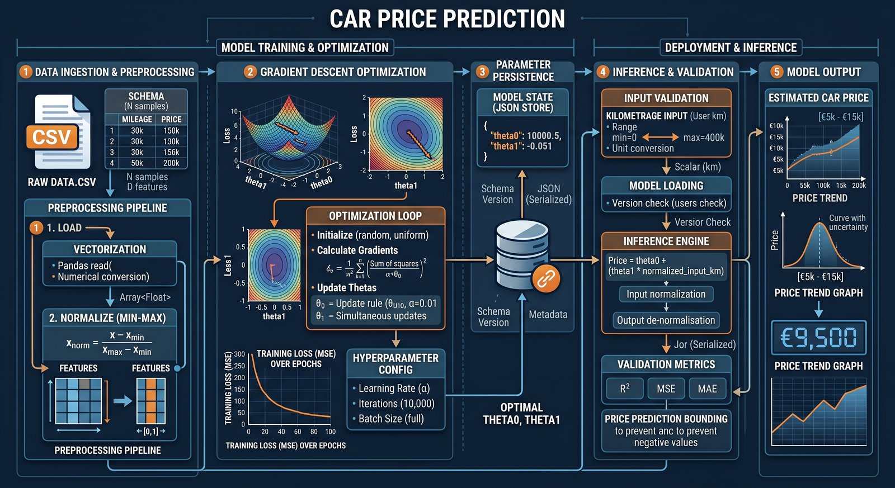

# <span class="h1">Linear Regression</span>

<div class="badge-section">
<div class="badge-row">
    
    
    
    
    
    
</div>
</div>

<p class="intro">
    Premier projet de <strong>Machine Learning</strong> : une régression linéaire codée de zéro, entraînée par une <strong>descente de gradient</strong>.
</p>

---

## <span class="h2">Présentation</span>

Le projet **Linear Regression** consiste à écrire, sans aucune bibliothèque de machine learning, une régression linéaire simple :

```console
estimatePrice(mileage) = θ₀ + θ₁ × mileage
```

- `θ₀` : le prix de départ (voiture à 0 km)
- `θ₁` : la perte de valeur **par kilomètre**

Le but de l'apprentissage : trouver les meilleurs `θ₀` et `θ₁` pour que cette droite **colle au mieux aux 24 données réelles** du sujet (kilométrage → prix de voiture d'occasion).

Le cœur du projet est la **descente de gradient** : un algorithme d'optimisation itératif qui ajuste les paramètres petit à petit, comme s'il descendait une colline jusqu'à trouver la vallée (le minimum de l'erreur).

---

## <span class="h2">Le projet</span>

*Introduction au machine learning.*

**L'objectif** : vivre le premier algorithme d'apprentissage automatique de bout en bout, sans boîte noire.

!!! warning "La règle du jeu"
    Aucune triche possible : `numpy.polyfit` **et** `scikit-learn` sont **interdits**.

    Tout est implémenté à la main :

    - La normalisation.
    - Les gradients.
    - Les métriques.
    - Les graphiques.

Le programme final se compose de **deux scripts qui communiquent** :

1. **`entrainement.py`**: Lit `data.csv`, exécute la descente de gradient et **sauvegarde** `θ₀` et `θ₁` dans `thetas.json`
2. **`predict_prix.py`**: Recharge le fichier, demande un kilométrage à l'utilisateur et **prédit** le prix

**En bonus** : le calcul de précision **MSE, MAE, R²** et la **visualisation** de la droite de régression.

---

## <span class="h2">La descente de gradient : le cœur du projet</span>

### 1. Normaliser pour stabiliser

Le kilométrage (jusqu'à 240 000) et le prix (quelques milliers) n'ont **pas la même échelle**. Sans normalisation, la descente oscillerait ou divergerait. On ramène tout vers `[0, 1]` :

```console
x_norm = (x - x_min) / (x_max - x_min)
```

### 2. Boucle d'entraînement (10 000 itérations)

À chaque itération, on mesure l'erreur du modèle courant, puis on calcule les **gradients**: la direction dans laquelle la fonction de coût (**MSE**) monte :

```bash
y_pred          = θ₀ + θ₁ · x_norm          # prédiction actuelle
gradient_θ₀     = (1/n) · Σ erreur          # dérivée partielle / θ₀
gradient_θ₁     = (1/n) · Σ (erreur · x)    # dérivée partielle / θ₁
θ₀ -= 0.01 · gradient_θ₀                    # un petit pas dans le SENS
θ₁ -= 0.01 · gradient_θ₁                    # OPPOSÉ du gradient
```

!!! tip "Pourquoi simultanément ?"
    Les deux mises à jour se font **à partir des mêmes prédictions**. Si l'on modifie `θ₀` avant de calculer le gradient de `θ₁`, l'algorithme diverge.

### 3. Dénormaliser et sauvegarder

L'entraînement a eu lieu sur des données `[0, 1]` : on **ramène θ₀ et θ₁ à l'échelle réelle** (€, km) puis on les sauvegarde pour la prédiction :

```json
{ "theta0": 8480.966554681116, "theta1": -0.021271757648460635 }
```

### 4. Cycle d'utilisation

<figure markdown>
  {.project-architecture}
  <figcaption>Architecture globale du système de prédiction de prix de voiture par régression linéaire</figcaption>
</figure>

1. **Ingestion & Prétraitement des données** : Chargement du fichier data.csv et normalisation Min-Max des variables (kilométrage et prix) vers l'intervalle `[0, 1]` pour garantir la stabilité de l'entraînement.
2. **Optimisation par descente de gradient** : Boucle d'entraînement itérative (10 000 étapes) minimisant la fonction de coût MSE pour ajuster simultanément les paramètres **`theta_0`** et **`theta_1`**.
3. **Persistance des paramètres** : Dénormalisation des coefficients appris et sauvegarde sous forme sérialisée dans le fichier `thetas.json`.
4. **Inférence & Validation** : Contrôle des saisies utilisateur (kilométrage), chargement des thétas, calcul de la prédiction et évaluation du modèle via les métriques **`R²`**, **`MSE`** et **`MAE`**.
5. **Restitution du résultat** : Génération du prix estimé (avec sécurité anti-valeur négative) et affichage de la droite de régression sur le nuage de points.

---

## <span class="h2">Extension : les moindres carrés</span>

Après le projet, j'ai ajouté une **deuxième implémentation** pour comparer les approches : la **méthode des moindres carrés (OLS)**, qui résout le même problème de manière **analytique**.

Une formule fermée, sans itération :

```console
β₁ = Σ[(Xᵢ - X̄)(Yᵢ - Ȳ)] / Σ[(Xᵢ - X̄)²]
β₀ = Ȳ - β₁ · X̄
```

Deux cas d'usage ont été ajoutés : prédiction d'une **note d'école** selon les heures d'étude, et du **prix d'une voiture** (version OLS).

| | Moindres carrés | Descente de gradient |
| --- | --- | --- |
| Résolution | Analytique (formule fermée) | Itérative (10 000 étapes) |
| Normalisation | Aucune | Min-max vers `[0, 1]` |
| Persistance | Calcul à la volée | `thetas.json` |
| Évaluation | Visuel uniquement | MSE, MAE, R² |

---

## <span class="h2">Architecture</span>

Le dépôt public est organisé en **deux parties indépendantes**, chacune autonome :

```console
linear-regression/
├── requirements.txt
├── method_moindre_carre/            # Extension : moindres carrés (OLS)
│   ├── predict_note_ecole/          # Prédiction de notes selon les heures d'étude
│   └── predict_prix_voiture/        # Prédiction du prix selon le kilométrage
└── method_decente_gradient/         # LINEAR REGRESSION : descente de gradient
    ├── entrainement.py              # Entraîne le modèle: thetas.json
    ├── predict_prix.py              # Prédiction interactive du prix
    ├── bonus.py                     # Évaluation (MSE, MAE, R²) + visualisation
    ├── logger.py                    # Logging coloré partagé
    └── utils.py                     # Chargement CSV, lecture des thetas
```

---

## <span class="h2">Technologies</span>

<div class="skill-grid">

<div class="skill-card">
    <span class="skill-card-title">Langage</span><br>
    <span class="skill-card-desc"><strong>Python</strong><br><em>scripting, typage des entrées de fonctions</em></span>
</div>

<div class="skill-card">
    <span class="skill-card-title">Bibliothèques</span><br>
    <span class="skill-card-desc"><strong>NumPy</strong><br><em>calcul vectoriel et tableaux</em><br><strong>Pandas</strong><br><em>chargement et manipulation des CSV</em><br><strong>Matplotlib</strong><br><em>nuage de points et droite de régression</em></span>
</div>

<div class="skill-card">
    <span class="skill-card-title">Algorithme</span><br>
    <span class="skill-card-desc"><strong>Descente de gradient</strong><br><em>optimisation itérative, 10 000 étapes, taux d'apprentissage 0,01</em><br><strong>Moindres carrés (OLS)</strong><br><em>solution analytique (extension)</em></span>
</div>

<div class="skill-card">
    <span class="skill-card-title">Magie interdite</span><br>
    <span class="skill-card-desc"><strong>zéro scikit-learn</strong><br><em>ni polyfit, ni LinearRegression : tout est écrit à la main</em></span>
</div>

</div>

---

## <span class="h2">Fonctionnalités</span>

| Script | Rôle | Méthode |
| ------ | ---- | ------- |
| `entrainement.py` | Ajuster θ₀ et θ₁, sauvegarder `thetas.json` | Descente de gradient |
| `predict_prix.py` | Prédiction interactive du prix (demande le km) | Descente de gradient |
| `bonus.py` | MSE, MAE, R² + graphique `regression_lineaire.png` | Évaluation |
| `predict_note.py` | Prédire une note (/10) selon les heures d'étude | Extension OLS |
| `predict_prix.py` (OLS) | Prédire un prix selon le kilométrage configurable | Extension OLS |

---

## <span class="h2">Problème | Solution</span>

| Problème | Solution |
| ---------- | ---------- |
| Apprendre le ML sans bibliothèque toute faite | Implémenter la descente de gradient à la main : gradients, pas d'apprentissage, convergence |
| Instabilité avec des échelles très différentes | **Normalisation min-max** des données vers `[0, 1]`, puis dénormalisation de θ₀ et θ₁ |
| Mettre à jour θ₀ et θ₁ sans quoi rien ne converge | Calcul des deux gradients à partir des mêmes prédictions, puis **mise à jour simultanée** |
| Un kilométrage extrême donne un prix négatif | Détection dans `predict_prix.py` : prix négatif → avertissement au lieu d'une prédiction absurde |
| Mesurer la qualité du modèle | Bonus : calcul de **MSE, MAE et R²** |
| Expliquer visuellement le résultat | **Graphique Matplotlib** : nuage de points + droite de régression |
| Garder les paramètres entre entraînement et prédiction | Sauvegarde de θ₀ et θ₁ dans **`thetas.json`** |

---

## <span class="h2">Résultats</span>

- **Droite de régression finale** (descente de gradient, 10 000 itérations) :
  - `θ₀ = 8 480,97` : Prix estimé d'une voiture à 0 km
  - `θ₁ = -0,0213` : Perte de valeur par kilomètre
- **Métriques d'évaluation** (`bonus.py`) :
  - **MAE = 556,48 €** : Erreur moyenne absolue
  - **MSE = 445 729,27 €²** : Erreur quadratique moyenne
  - **R² = 0,733** : 73 % de la variance du prix expliquée par le kilométrage
- Estimation à 100 000 km : **≈ 6 353 €** · à 240 000 km (max du jeu) : **≈ 3 376 €**
- L'extension moindres carrés converge vers les **mêmes paramètres**: preuve que les deux approches résolvent le même problème

---

## <span class="h2">Ce que j'ai appris</span>

Une régression linéaire est un **problème d'optimisation** : trouver les paramètres qui minimisent l'erreur.

La descente de gradient m'a fait comprendre que l'apprentissage automatique est une **boucle de rétroaction**:

- Prédire
- Mesurer l'écart
- Corriger un petit pas à la fois

Et que la **normalisation des données** peut changer radicalement la stabilité d'un algorithme.

Écrire les gradients à la main m'a aussi fait comprendre pourquoi les frameworks de ML existent… et pourquoi il vaut mieux savoir ce qu'ils font avant de les utiliser.

---

<div class="project-card" markdown>

## :material-chart-line: Tutoriel : Régression linéaire de zéro

Tu veux reproduire ce projet pas à pas ?

Le tutoriel couvre la théorie, la descente de gradient, la méthode des moindres carrés, l'évaluation et la visualisation avec le vrai code du dépôt.

[:octicons-arrow-right-24: Commencer le tutoriel](../cours/python/linear-regression.md){ .md-button .md-button--primary }

</div>

---

## <span class="h2">Lien</span>

[:fontawesome-brands-github: Voir le code](https://github.com/Lamizana/linear-regression){ .md-button .md-button--primary target="_blank" rel="noopener" }
