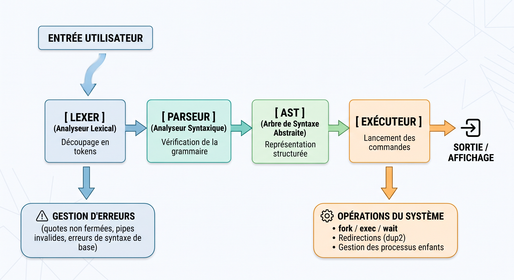

# Minishell

    
    
    
    

    Interpréteur de commandes UNIX (shell) inspiré de bash, développé en <strong>C</strong>.

---

## Présentation

Un **interpréteur de commandes UNIX** qui exécute des commandes, gère les pipes et les redirections, et réagit aux signaux comme le ferait un vrai terminal.

---

## Contexte

*Projet du tronc commun de l'école 42, réalisé en C.*

**L'objectif** : comprendre ce qui se passe réellement quand on tape une commande dans un terminal; les processus, les descripteurs de fichiers et les signaux.

---

## Mon rôle

- Conception du **REPL** (boucle read-eval-print)
- Architecture du **parseur en deux passes** (tokenisation puis AST)
- Implémentation des **builtins** et de la gestion des **signaux**

---

## Architecture

<figure markdown>
  {.project-architecture}
  <figcaption>Architecture du parseur et de l'exécuteur de commandes</figcaption>
</figure>

`Lexer → parseur → AST → exécuteur` : chaque étape est un module séparé, avec une gestion d'erreurs dédiée au parsing et l'exécution qui s'appuie sur `fork`/`exec`/`wait` et les redirections `dup2`.

---

## Technologies

- **Langage** : C
- **Système** : Linux/UNIX
- **Outils** : Makefile, GCC

---

## Fonctionnalités

- Commandes (cd, echo, pwd, export, unset, env, exit)
- Redirections (`>`, `>>`, `<`)
- Pipes (`|`)
- Variables d'environnement
- Gestion des erreurs

---

## Problème | Solution

| Problème | Solution |
| ---------- | ---------- |
| Distinguer un `\|` dans une chaîne `echo "a \| b"` d'une vraie pipe | Parseur en **deux passes** : tokenisation puis construction d'un AST, au lieu d'une lecture caractère par caractère |
| Ctrl+C doit interrompre la commande en cours mais pas le shell | Gestion des signaux **ciblée** : le signal est transmis au processus enfant, le shell reste actif |
| Enchaîner plusieurs commandes avec des pipes | Exécution **récursive de l'AST** avec mise en place des `dup2` dans l'ordre |
| Multiplier les états de parsing (quotes simples, doubles, échappements) | Gestion d'un **état explicite du lexer** pour chaque contexte |

---

## Résultats

- ✅ REPL complet : l'utilisateur tape, le shell exécute
- ✅ Builtins fonctionnelles : `cd`, `echo`, `pwd`, `export`, `unset`, `env`, `exit`
- ✅ Comportement des signaux aligné sur bash (`Ctrl+C`, `Ctrl+\`)
- ✅ Redirections et chaînes de pipes multi-commandes

---

## Ce que j'ai appris

J'ai compris le pipeline `fork → exec → wait` : je vois désormais chaque `ls` comme un processus qui naît, vit et meurt.

La gestion des signaux m'a appris qu'un programme est défini autant par ce qu'il fait que par ce qu'il **refuse** de faire, et que le parsing d'entrées utilisateur est un terrain miné, une citation mal fermée fait tout exploser.

---

## Lien

[:fontawesome-brands-github: Voir le code](https://github.com/Lamizana/Minishell){ .md-button .md-button--primary target="_blank" rel="noopener" }
[:material-message-text: Contribuer](https://github.com/Lamizana/Minishell/issues){ .md-button target="_blank" rel="noopener" }
