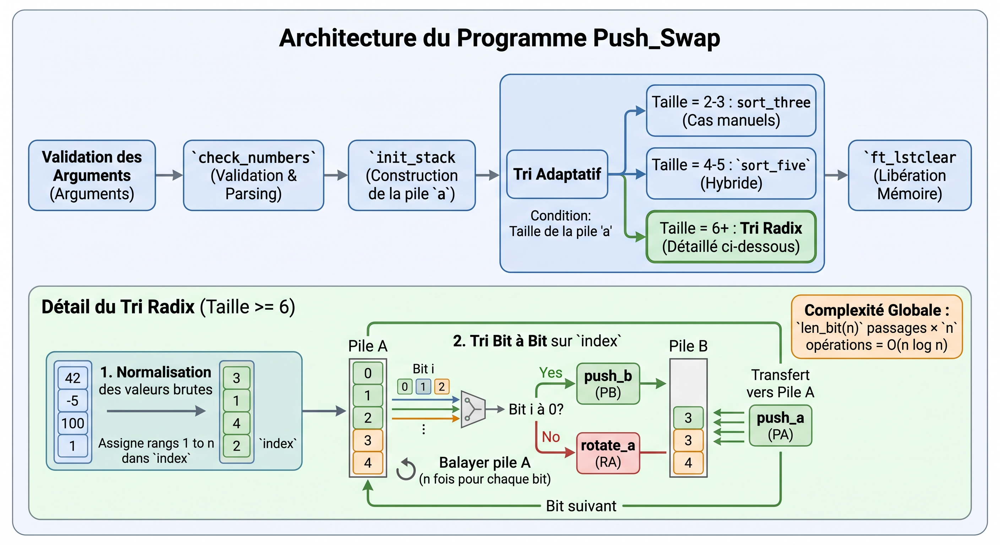

# <span class="h1">Push_swap</span>

<div class="badge-section">
<div class="badge-row">
    
    
    
    
</div>
</div>

<p class="intro">
    Algorithme de tri de nombres développé en <strong>C</strong> : trier une pile avec un minimum d'opérations.
</p>

---

## <span class="h2">Présentation</span>

Un programme qui trie des nombres entiers à l'aide de **deux piles** et d'un **ensemble restreint d'instructions** (`sa`, `sb`, `ss`, `pa`, `pb`, `ra`, `rb`, `rr`, `rra`, `rrb`, `rrr`).

L'objectif est de produire la **suite d'instructions la plus courte** qui range la pile `a` en ordre croissant, le plus petit nombre au sommet.

---

## <span class="h2">Contexte</span>

*Projet du tronc commun de l'école 42, réalisé en solo entre décembre 2022 et janvier 2023.*

**L'objectif** : ma première vraie rencontre avec la **complexité algorithmique** — comprendre que quelques instructions demandées en millions d'exemplaires se paient en coût de calcul, et choisir une stratégie en conséquence.

---

## <span class="h2">Mon rôle</span>

Projet **100 % solo**, mené de bout en bout :

- **Parsing** des arguments (plusieurs arguments ou une seule chaîne entre quotes) et gestion des erreurs
- Conception des **algorithmes de tri** — avec trois approches essayées et abandonnées avant la bonne
- **Implémentation** des 11 instructions sur une liste chaînée
- **Tests & validation** : checker Linux officiel, testeur maison et vérification mémoire

---

## <span class="h2">Architecture</span>

Le programme enchaîne quatre étapes : validation des arguments, construction de la pile, tri adaptatif, et libération de la mémoire.

<figure markdown>
  {.project-architecture}
  <figcaption>Schéma de l'architecture de Push Swap</figcaption>
</figure>

**Le tri radix** est le cœur du projet pour les grandes listes. Les valeurs brutes (potentiellement négatives, espacées, voire énormes) sont d'abord **normalisées** : chaque nombre reçoit un **rang** de `1` à `n` (le plus petit devient `1`, le plus grand `n`), stocké dans le champ `index`. Le tri se fait ensuite **bit à bit** sur ces rangs :

1. On calcule `len_bit(n)` : le nombre de bits nécessaires pour représenter `n`
2. Pour chaque bit `i`, on balaie la pile : bit à `1` → `rotate_a`, bit à `0` → `push_b`
3. On remonte chaque élément de `b` vers `a` via `push_a`, puis on passe au bit suivant

Chaque passage sépare les éléments selon un bit du rang, pour un total de `len_bit × n` opérations : **O(n log n)**.

---

## <span class="h2">Technologies</span>

<div class="skill-grid">

<div class="skill-card">
    <span class="skill-card-title">Langage</span><br>
    <span class="skill-card-desc"><strong>C</strong><br><em>Gestion mémoire manuelle, pointeurs, liste chaînée</em></span>
</div>

<div class="skill-card">
    <span class="skill-card-title">Compilation</span><br>
    <span class="skill-card-desc"><strong>Makefile</strong><br><em>build automatisé: clang -Wall -Werror -Wextra, sans relink</em></span>
</div>

<div class="skill-card">
    <span class="skill-card-title">Structures</span><br>
    <span class="skill-card-desc"><strong>Liste chaînée</strong><br><em>piles A et B, chaque nœud porte une valeur et son rang</em></span>
</div>

<div class="skill-card">
    <span class="skill-card-title">Complexité</span><br>
    <span class="skill-card-desc"><strong>O(n log n)</strong><br><em>tri radix binaire sur indices normalisés</em></span>
</div>

</div>

---

## <span class="h2">Fonctionnalités</span>

| Fonction | Rôle | Accès |
| ---------- | ------ | ------- |
| Parseur d'arguments | Accepte des nombres séparés OU une chaîne unique `"1 3 -2 5"` (espaces, tabs) | Tous |
| Vérification des entrées | Rejette non-nombres, valeurs hors `int`, doublons, chaînes vides | `Error\n` sur stderr |
| 11 instructions | `sa sb ss` · `pa pb` · `ra rb rr` · `rra rrb rrr` | affichées une par ligne |
| Tri adaptatif | Cas manuels 2-3, hybride 4-5, radix 6+ | automatique |
| Conversion sûre | `ft_atoi` maison en `long` avec détection de débordement | — |

---

## <span class="h2">Problème | Solution</span>

| Problème | Solution |
| ---------- | ---------- |
| Les premiers algorithmes « marchent mais font trop de coups » (`zehd_sort`, `ft_algo`…) | Trois prototypes abandonnés dans `utils/`, puis passage au **tri radix** binaire |
| Trier des valeurs négatives, énormes ou non contiguës | **Normalisation** : chaque valeur est remplacée par son rang `1..n` avant le tri |
| Débordement de `int` sur des entrées piégées (`999999999999999`) | `ft_atoi` maison en `long`, flag d'erreur si hors `[-2147483648, 2147483647]` |
| Doublons et chaînes vides invisibles à l'œil | Vérifications `ft_doublon` / `ft_doublon_stack` et `check_empty_str` avant construction |
| Fuites mémoire en C | Libération complète des listes (`ft_lstclear`) et vérification valgrind via testeur |

---

## <span class="h2">Résultats</span>

Mesures réelles produites par le programme (vérifiées avec le `checker_linux` officiel : `OK`) :

| Taille | Opérations |
|--------|-----------|
| 3 éléments | ≤ 3 |
| 5 éléments | ≤ 12 |
| 100 éléments | ≈ 1081 |
| 500 éléments | ≈ 6778 |

Le programme **valide le checker** sur 100 et 500 éléments, et ne produit **aucune fuite mémoire** (testé via `valgrind`).

---

## <span class="h2">Tests & Visualisation</span>

### Testeur push_swap (« push_swap-testeur-max »)

Un testeur en **Vala** pour vérifier les cas d'erreurs, la moyenne des coups et les fuites mémoire :

```bash
# Depuis le dossier push_swap/
cd push_swap-testeur-max
make

./tester_push_swap              # bat tous les cas d'erreurs de parsing
./tester_push_swap true         # ne montrer que les cas corrects
./tester_push_swap false        # ne montrer que les cas erronés
./tester_push_swap leak         # (ou "valgrind") vérifie malloc/free
./tester_push_swap 100 10       # moyenne + max des coups sur 10 tirages de 100
```

Le testeur cherche `push_swap` et `checker_linux` dans son dossier (sinon `../`).

### Visualiseur (« visualizer-push-swap »)

Un **visualiseur GTK** qui génère une pile aléatoire, exécute votre `push_swap`, puis **joue chaque instruction en direct** sur les piles A et B (avec compteur de coups) :

```bash
# Depuis le dossier push_swap/
cd visualizer-push-swap
make

# placer (ou pointer) l'exécutable push_swap à côté du visualiseur
cp ../push_swap .
./vizualizer 100                # anime un tri de 100 nombres aléatoires
```

La vitesse et le zoom sont réglables dans le code (`G_SPEED`, `G_ZOOM`), et le visualiseur gère les 11 instructions (`ra`, `rra`, `sa`, `sb`, `ss`, `pb`, `pa`, `rb`, `rrb`, `rr`, `rrr`).

---

## <span class="h2">Ce que j'ai appris</span>

J'ai compris que la « complexité » n'est pas un concept de cours : c'est le moment précis où un programme passe de l'instantané à l'interminable selon le nombre d'éléments.

Ce projet m'a aussi appris la **persévérance** : j'ai écrit trois algorithmes qui fonctionnaient mais perdaient trop de coups avant d'accepter de normaliser le problème et d'utiliser le tri radix — une solution simple une fois qu'on a changé de point de vue.

---

## <span class="h2">Lien</span>

[:fontawesome-brands-github: Voir le code](https://github.com/Lamizana/Push-swap){ .md-button .md-button--primary target="_blank" rel="noopener" }