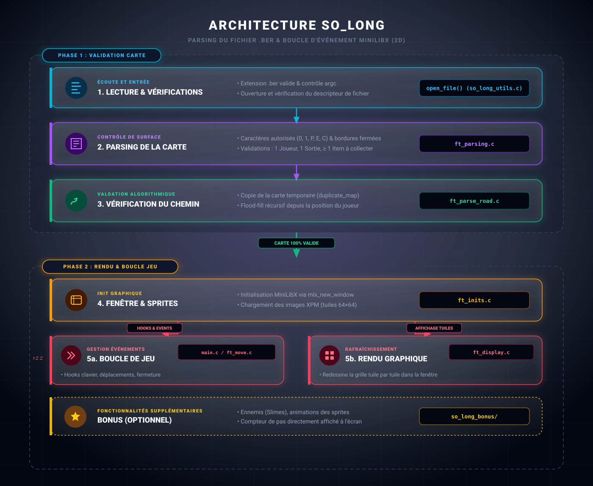

# <span class="h1">So Long</span>

{.player-solong}

<div class="badge-section">
<div class="badge-row">
    
    
    
    
    
</div>
</div>

<p class="intro">
    Petit jeu 2D développé en <strong>C</strong> avec la <strong>MiniLibX</strong> : le joueur collecte tous les objets d'un labyrinthe puis atteint la sortie.
</p>

---

## <span class="h2">Présentation</span>

Un **jeu 2D en labyrinthe** où l'on déplace un personnage tuile par tuile : ramasser tous les objets, éviter les murs (et le slime en bonus), puis sortir par la porte une fois le niveau nettoyé.

---

## <span class="h2">Contexte</span>

Projet de la branche **graphique** du tronc commun 42 : prendre en main la **MiniLibX** (bibliothèque X11 fournie par l'école) pour gérer une fenêtre, charger des sprites, capter les événements clavier/souris et afficher un rendu fluide.

*Projet réalisé en solo, en janvier 2023, avec une version bonus complète.*

---

## <span class="h2">Mon rôle</span>

Développeur **solo** sur l'ensemble du projet :

- **Partie obligatoire** : parsing des cartes `.ber`, validation du chemin, rendu et gestion des événements
- **Partie bonus** : ennemi slime, écrans de victoire et game over, sprites animés et compteurs affichés à l'écran

---

## <span class="h2">Architecture</span>

Le jeu se déroule en deux temps : une **validation complète de la carte** avant d'ouvrir la fenêtre, puis une **boucle d'événements** MiniLibX qui redessine les tuiles à chaque déplacement.

<figure markdown>
  {.project-architecture}
  <figcaption>Schéma de l'architecture de So Long</figcaption>
</figure>

| Étape | Rôle | Dans le code |
|-------|------|--------------|
| **Lecture & vérifs** | Ouverture du fichier `.ber`, extension valide, argc | `open_file()` (`so_long_utils.c`) |
| **Parsing** | Caractères autorisés, bordures fermées, 1 joueur, 1 sortie, ≥ 1 objet | `ft_parsing.c` |
| **Chemin** | Copie de la carte (`duplicate_map`) + flood-fill récursif depuis le joueur | `ft_parse_road.c` |
| **Fenêtre & sprites** | `mlx_new_window`, chargement des images XPM 64×64 | `ft_inits.c` |
| **Boucle de jeu** | Hooks clavier + fermeture fenêtre, déplacements | `main.c`, `ft_move.c`, `ft_event_move.c` |
| **Rendu** | Affichage tuile par tuile dans la fenêtre | `ft_display.c` |
| **Bonus** | Slime, animations, compteurs à l'écran | `so_long_bonus/` |

---

## <span class="h2">Technologies</span>

<div class="skill-grid">

<div class="skill-card">
    <span class="skill-card-title">Langage & Build</span><br>
    <span class="skill-card-desc"><strong>C</strong><br><em>Norme 42, compilé avec clang et les flags -Wall -Wextra -Werror.</em><br><strong>Makefile</strong><br><em>Règles all, bonus, clean, fclean, re.</em></span>
</div>

<div class="skill-card">
    <span class="skill-card-title">Graphique</span><br>
    <span class="skill-card-desc"><strong>MiniLibX (X11)</strong><br><em>Vendue dans le dépôt (mlx_linux/), compilée par le Makefile.</em><br><strong>Sprites XPM</strong><br><em>Images 64×64 (PIXEL 64), chargées via mlx_xpm_file_to_image.</em></span>
</div>

<div class="skill-card">
    <span class="skill-card-title">Parsing & Chemin</span><br>
    <span class="skill-card-desc"><strong>Cartes .ber</strong><br><em>Validation stricte : murs sur les bordures, unicité du joueur et de la sortie, au moins un objet.</em><br><strong>Flood-fill récursif</strong><br><em>Vérifie que tous les objets et la sortie sont atteignables.</em></span>
</div>

<div class="skill-card">
    <span class="skill-card-title">Bonus</span><br>
    <span class="skill-card-desc"><strong>Ennemi slime</strong><br><em>Symbole M, le toucher déclenche un game over.</em><br><strong>Affichage HUD</strong><br><em>Compteurs d'objets et de mouvements via mlx_string_put.</em></span>
</div>

</div>

---

## <span class="h2">Fonctionnalités</span>

- **Cartes `.ber`** : validation du format (extension, caractères `0/1/E/C/P`), des bordures, de l'unicité de `P` et `E`, et présence d'au moins un objet
- **Vérification de chemin** : flood-fill récursif garantissant l'accès à tous les objets et à la sortie
- **Déplacements au clavier** : `ZQSD` (clavier AZERTY) / `WASD` (partie obligatoire), **flèches directionnelles** (bonus)
- **Collecte et sortie** : la porte ne s'ouvre qu'une fois tous les objets ramassés
- **Compteur de mouvements** incrémenté à chaque déplacement
- **Fermeture propre** : touche `Échap` ou croix de la fenêtre, avec libération de la mémoire
- **Bonus** : ennemi slime (`M`) → game over, écran de victoire, sprites du joueur orientés, animation des objets collectés, compteurs affichés à l'écran

---

## <span class="h2">Problème <span class="h2-sep">|</span> Solution</span>

| Problème | Solution |
| ---------- | ---------- |
| Des cartes invalides doivent être refusées proprement | Validation en plusieurs passes (`ft_parsing.c`) avec messages `Error` sur stderr et libération de la mémoire |
| Un objet ou la sortie peut être bloqué par des murs | Flood-fill récursif sur une copie de la carte (`duplicate_map`) : toute case `C`/`E` non atteinte entraîne une erreur |
| Fermer le jeu sans fuite de mémoire | `ft_close` / `ft_error` : destruction des images, de la fenêtre et libération du tableau de la carte |
| Afficher un labyrinthe fluide | Rendu tuile par tuile en `mlx_put_image_to_window`, sprites 64×64 préchargés |

---

## <span class="h2">Résultats</span>

- Deux binaires compilés : `so_long` (partie obligatoire) et `solong_bonus` (bonus)
- Boîte d'erreurs complète qui refuse toute carte invalide sans crasher
- Cinq cartes de test fournies (dont deux pour le bonus avec ennemis)
- Bonus complet : game over, victoire, compteurs à l'écran

**Lancement**

```bash
make                 # compile so_long (partie obligatoire)
make bonus           # compile solong_bonus (partie bonus)
./so_long carte_01.ber            # partie obligatoire
./solong_bonus carte_03_bonus.ber # partie bonus
```

---

## <span class="h2">Tests & Visualisation</span>

<div style="display: flex; justify-content: center; gap: 20px; margin: 20px 0; flex-wrap: wrap;">
  <div style="flex: 1; min-width: 300px; max-width: 48%;">
    <p style="text-align: center; font-weight: bold; margin-bottom: 10px;">Version Standard</p>
    <div style="position: relative; padding-bottom: 56.25%; height: 0; overflow: hidden; border-radius: 8px; box-shadow: 0 4px 8px rgba(0, 0, 0, 0.3);">
      <video class="video" controls style="position: absolute; top: 0; left: 0; width: 100%; height: 100%;">
        <source src="../videos/soLong.mp4" type="video/mp4">
        Votre navigateur ne supporte pas la vidéo.
      </video>
    </div>
  </div>
  <div style="flex: 1; min-width: 300px; max-width: 48%;">
    <p style="text-align: center; font-weight: bold; margin-bottom: 10px;">Version Bonus</p>
    <div style="position: relative; padding-bottom: 56.25%; height: 0; overflow: hidden; border-radius: 8px; box-shadow: 0 4px 8px rgba(0, 0, 0, 0.3);">
      <video class="video" controls style="position: absolute; top: 0; left: 0; width: 100%; height: 100%;">
        <source src="../videos/soLong_bonus.mp4" type="video/mp4">
        Votre navigateur ne supporte pas la vidéo.
      </video>
    </div>
  </div>
</div>

---

## <span class="h2">Ce que j'ai appris</span>

**so_long** m'a appris à réfléchir en **tuiles** : chaque déplacement est une simple opération sur un tableau 2D `char`, et l'écran n'est qu'une projection de cette matrice sur la fenêtre.

Le **flood-fill** a été mon premier vrai algorithme de graphe : transformer une carte en problème d'accessibilité (toutes les cases `C` et `E` sont-elles reliées à `P` ?) m'a fait comprendre la différence entre vérifier les caractères et vérifier la **topologie** de la carte.

J'ai aussi découvert la discipline de la **gestion mémoire avec MiniLibX** : chaque `mlx_xpm_file_to_image` demande un `mlx_destroy_image`, et une fenêtre qui ne se ferme pas proprement est une fuite visible au `valgrind`.

---

## <span class="h2">Lien</span>

[:fontawesome-brands-github: Voir le code](https://github.com/Lamizana/So-long){ target="_blank" rel="noopener" .md-button .md-button--primary }