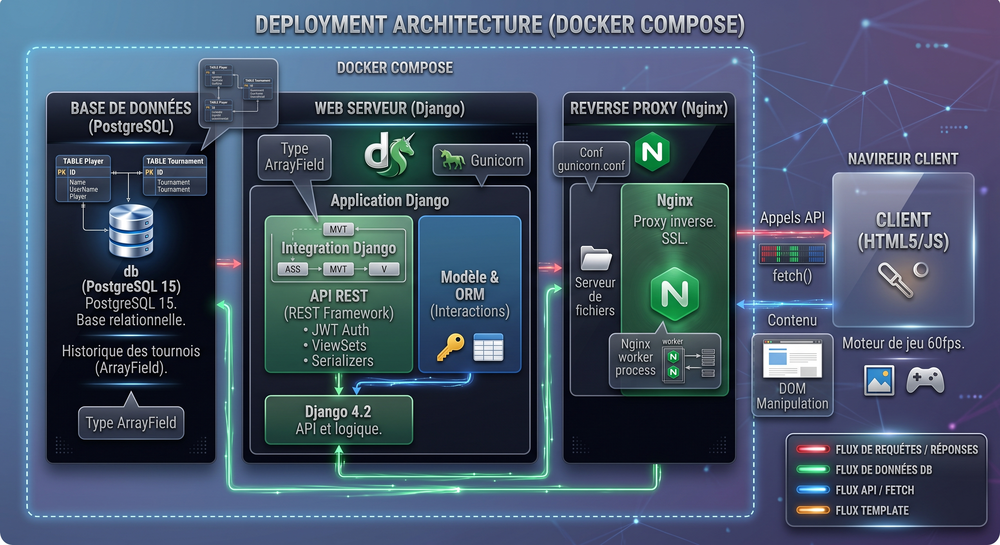

# <span class="h1">Transcendance</span>

<div class="badge-section">
<div class="badge-row">
    
    
    
    
    
    
    
</div>
</div>

<p class="intro">
    Projet final du tronc commun de l'école 42 : créer une application web complète permettant de jouer au <strong>Pong</strong> en local.
</p>

---

## <span class="h2">Présentation</span>

Une application web **full-stack** pour jouer au **Pong** en local : **1 contre 1**, **4 joueurs**, **tournoi**, interface **multi-langue** avec gestion des comptes utilisateurs.

---

## <span class="h2">Contexte</span>

Transcendance est le **dernier projet du tronc commun 42**. L'objectif était de concevoir une application web full-stack fonctionnelle, déployable via Docker, intégrant un jeu Pong jouable en local sur un même navigateur. Le projet combinait développement back-end (API REST), front-end (rendu Canvas), gestion d'utilisateurs, base de données relationnelle et conteneurisation, le tout en **solo**.

---

## <span class="h2">Mon rôle</span>

Développeur **full-stack solo** sur l'ensemble du projet :

- **Back-end** : Django 4.2, modélisation PostgreSQL, API REST (Django REST Framework), authentification, gestion des profils et des scores
- **Front-end** : moteur de jeu Pong en vanilla JavaScript sur `<canvas>` HTML5, gestion des entrées clavier et tactile, IA adverse
- **Infra** : Docker Compose (3 conteneurs), configuration Nginx avec SSL/TLS, migrations Django

---

## <span class="h2">Architecture</span>

<figure markdown>
  {.project-architecture}
  <figcaption>Schéma de l'architecture de Transcendance</figcaption>
</figure>

Les requêtes HTTP entrent par **Nginx**, qui termine le SSL et les transmet à **gunicorn** ; Django aiguille vers les apps `pong` et `utilisateurs`, interroge **PostgreSQL** et renvoie un HTML rendu côté serveur, pendant que le moteur de jeu s'exécute en JavaScript sur le canvas du navigateur.

| Étape | Rôle | Dans le code |
|-------|------|--------------|
| **Navigateur** | L'utilisateur charge `/pong/` ; le moteur de jeu démarre sur le canvas | `pong.js`, `router.js`, HTML5 Canvas |
| **Nginx** | Reverse proxy, terminaison SSL/TLS, service des fichiers statiques | `nginx/nginx.conf` (port 8080) |
| **Gunicorn** | Serveur WSGI qui exécute Django | conteneur `web`, `proxy_pass http://web:8000` |
| **Django** | Routage des URLs, vues, API REST, auth de session | apps `pong` + `utilisateurs`, viewsets DRF |
| **PostgreSQL** | Persistance des profils, scores, duels, tournois | modèle `Player` + `ArrayField` |

Deux apps **Django** : `utilisateurs` (inscription, connexion, déconnexion) et `pong` (jeu, profil, amis, scores).

Côté client, un **routeur JavaScript** (`router.js`) récupère le HTML par `fetch()` et applique la langue: un fonctionnement type SPA sans framework.

---

## <span class="h2">Technologies</span>

<div class="skill-grid">

<div class="skill-card">
    <span class="skill-card-title">Back-end</span><br>
    <span class="skill-card-desc"><strong>Python 3.12</strong><br><em>Langage principal du back-end.</em><br><strong>Django 4.2</strong><br><em>Framework web : ORM, auth, templates, admin.</em><br><strong>Django REST Framework</strong><br><em>API REST avec serializers et viewsets.</em></span>
</div>

<div class="skill-card">
    <span class="skill-card-title">Front-end</span><br>
    <span class="skill-card-desc"><strong>JavaScript vanilla</strong><br><em>Moteur de jeu, gestion DOM, appels API fetch().</em><br><strong>HTML5 Canvas</strong><br><em>Rendu du terrain de jeu, raquettes, balle, score.</em><br><strong>Bootstrap 5</strong><br><em>Composants UI : modals, boutons, formulaires.</em></span>
</div>

<div class="skill-card">
    <span class="skill-card-title">Base de données</span><br>
    <span class="skill-card-desc"><strong>PostgreSQL 15</strong><br><em>Stockage des profils, scores, duels, tournois, amis.</em><br><strong>ArrayField (psycopg2)</strong><br><em>Tableaux d'historique sans jointures — duels, positions de tournoi.</em></span>
</div>

<div class="skill-card">
    <span class="skill-card-title">Infra & DevOps</span><br>
    <span class="skill-card-desc"><strong>Docker Compose</strong><br><em>Orchestration de 3 conteneurs avec volumes et migrations.</em><br><strong>Nginx</strong><br><em>Reverse proxy SSL, proxy_pass, fichiers statiques.</em><br><strong>Makefile</strong><br><em>Commandes make create, make re, make fclean, make psql…</em></span>
</div>

<div class="skill-card">
    <span class="skill-card-title">Déploiement</span><br>
    <span class="skill-card-desc"><strong>SSL/TLS</strong><br><em>Certificats auto-signés, TLSv1.2/1.3.</em><br><strong>Gunicorn</strong><br><em>Serveur WSGI production derrière Nginx.</em><br><strong>Migrations Django</strong><br><em>makemigrations + migrate via Makefile.</em></span>
</div>

</div>

---

## <span class="h2">Fonctionnalités</span>

- **Mode Solo** : partie contre l'IA, premier à 3 points
- **1v1 local** : deux joueurs, un clavier (W/S vs flèches)
- **4 joueurs** : quadra sur canvas carré, 4 palettes colorées avec murs d'angles
- **Tournoi 4** : bracket saisi par l'utilisateur, demi-finales + finale
- **Multi-langue** : FR, EN, ES — toute l'interface traduite via balises `lang=""` et routeur JS
- **Profil & avatar** : création, modification du mot de passe, suppression de compte
- **Système d'amis** : ajout par nickname, liste persistante, statut en ligne
- **Scores & historique** : wins/loses, détail par duel (adversaire, score, date), positions de tournoi

---

## <span class="h2">Problème <span class="h2-sep">|</span> Solution</span>

| Problème | Solution |
|----------|----------|
| Le jeu devait être jouable de 320px (mobile) à 1440px+ sans distortion | Calcul dynamique des dimensions Canvas avec 5 paliers de `window.innerWidth`, normalisation de toutes les positions par `canvas.height / 1000` |
| La balle accélérait indéfiniment après chaque rebond, rendant le jeu ingérable | Conservation de la vitesse totale via Pythagore : `speed = √(12² − speedy²)` à chaque collision — la vitesse reste constante quelle que soit l'angle |
| Une IA qui suit simplement la balle est trop facile à battre | L'IA prédit le point d'intersection y de la trajectoire au niveau de sa raquette, puis ajoute un bruit aléatoire (±10px) pour une difficulté imparfaite mais crédible |

---

## <span class="h2">Résultats</span>

- 4 modes de jeu fonctionnels (solo, 1v1, 4 joueurs, tournoi)
- 3 langues complètes (FR, EN, ES)
- Déploiement Docker en une commande (`make create`)
- API REST complète : 5 viewsets DRF pour scores, tournois, profils, langues, statuts

### <span class="h3">Lancement</span>

```bash
make create        # docker compose up --build + migrations + superuser
make psql          # accès au shell PostgreSQL
make fclean        # arrêt total + purge des volumes et images
```

---

## <span class="h2">Ce que j'ai appris</span>

Transcendance m'a appris que **la plupart des projets "temps réel" en 42 ne le sont pas vraiment**. 

La vraie difficulté n'est pas le networking, mais la **gestion de l'état** côté client : qui possède la balle, quand le tour change, comment un score se propage au back-end. 

J'ai aussi compris pourquoi Docker n'est pas qu'un outil de déploiement mais une **contrainte d'architecture** : séparer web, base et proxy m'a forcé à penser les interfaces entre composants avant d'écrire la première ligne de code.

---

## <span class="h2">Lien</span>

[:fontawesome-brands-github: Voir le code](https://github.com/Lamizana/ft_transcendence){ target="_blank" rel="noopener" .md-button .md-button--primary }
