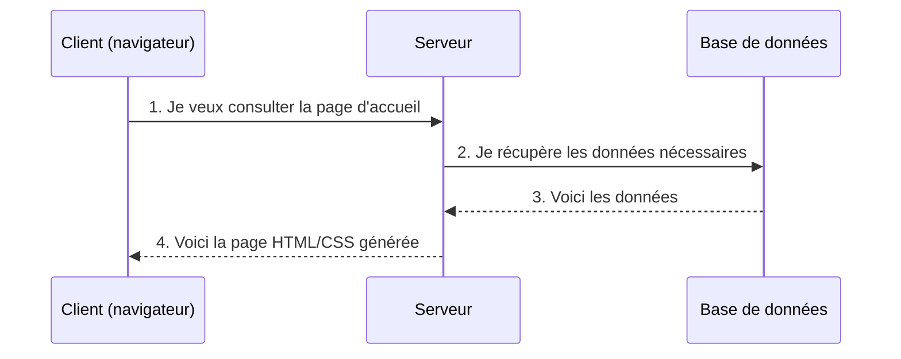

# Les langages du Web

    Pour créer un site web, on utilise plusieurs langages qui travaillent
    ensemble : côté client et côté serveur.

---

## Client vs Serveur

Il existe deux types d'ordinateurs connectés au Web :

| Rôle | Description |
|------|-------------|
| **Client** | Votre ordinateur, smartphone ou tablette — c'est l'appareil qui **consulte** les sites web via un navigateur. |
| **Serveur** | Une machine puissante qui **possède** les sites web et les envoie aux clients qui les demandent. |

!!! info "Les navigateurs"
    Pour accéder aux sites web, on utilise un navigateur : Google Chrome,
    Mozilla Firefox, Safari, Edge...
    Leur rôle est de **traduire** les langages (HTML, CSS, JS) en pages visuelles.

---

## Les langages client (Frontend)

Les langages client sont lus par le **navigateur**. Ils sont indispensables
à la réalisation de tout site web.

| Langage | Rôle |
|---------|------|
| **HTML** | Structure et contenu de la page (titres, paragraphes, images, liens) |
| **CSS** | Apparence visuelle (couleurs, mise en page, polices, animations) |
| **JavaScript** | Comportement interactif (menus, formulaires dynamiques, animations) |

!!! warning "Important"
    Un client ne sait lire **que** ces trois langages.
    Tout le reste est géré côté serveur.

---

## Les langages serveur (Backend)

Les langages serveur sont exécutés par le **serveur**. Ils décrivent
**comment le site doit se comporter**.

!!! example "Client vs Serveur"
    - **Client** : "Un menu doit s'afficher à gauche du site."
    - **Serveur** : "Le menu ne doit s'afficher que si l'utilisateur a un compte."

### Langages serveur populaires

| Langage | Framework(s) |
|---------|-------------|
| **PHP** | Symfony, Laravel, Zend |
| **Python** | Django, Flask |
| **Java** | Java EE, Spring |
| **C#** | ASP.NET |
| **Ruby** | Ruby on Rails |

!!! warning "Ne pas confondre"
    **Java** ≠ **JavaScript** — ce sont deux langages complètement différents,
    malgré le nom similaire.

!!! note "Framework vs CMS"
    Un **framework** est une boîte à outils pour développer un site sur mesure.
    Un **CMS** (Content Management System) comme **WordPress** est un logiciel
    clé en main pour créer un site sans coder.

---

## Comment ça fonctionne ?

L'interaction entre le client et le serveur se résume en 3 étapes :

!!! summary "Règle simple"
    - **Partie visible** du site → langage **client** (HTML, CSS, JS)
    - **Comportement et logique** → langage **serveur** (PHP, Python, etc.)

---

## Les bases de données

Tous les sites web ont besoin d'**enregistrer des informations**
(comptes utilisateurs, articles, commandes...).

| Logiciel de BDD | Type |
|-----------------|------|
| **MySQL** | Open source, très répandu |
| **PostgreSQL** | Open source, puissant et fiable |
| **SQLite** | Léger, fichier unique (pour les petites apps) |
| **SQL Server** | Microsoft, entreprise |
| **Oracle** | Entreprise, très gros volumes |

!!! info "SQL — Structured Query Language"
    Pour communiquer avec ces bases de données, on utilise le langage **SQL**.
    On fait des **requêtes SQL** : "je veux stocker ce message",
    "je veux récupérer tous les utilisateurs".

Le serveur est le seul à communiquer avec la base de données,
généralement hébergée sur une **machine différente**.

---

## Sites responsive vs Applications mobiles

| Type | Description | Quand choisir ? |
|------|-------------|-----------------|
| **Site responsive** | Un seul site web qui s'adapte à toutes les tailles d'écran | La plupart du temps ✅ |
| **Application native** | Application installée depuis les stores (App Store, Play Store) | Si besoin d'accès matériels (caméra, GPS offline) |

!!! tip "Recommandation"
    En général, **partez sur un site responsive**.
    C'est plus simple à maintenir et accessible à tous les appareils.
