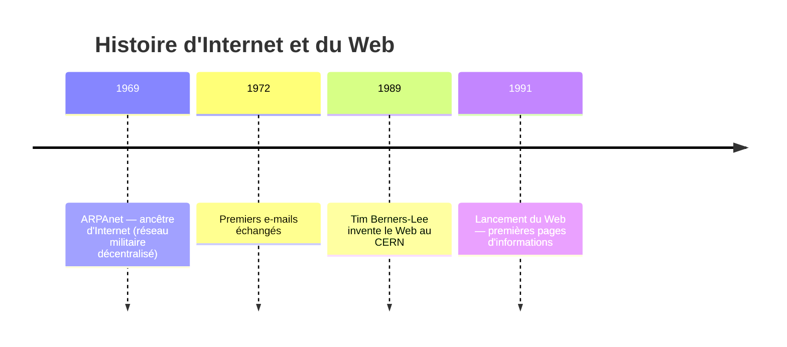

# La naissance du Web

    Internet et le Web ne sont pas la même chose. Découvrez comment tout a commencé.

---

## Internet vs le Web

!!! info "Définition"
    **Internet** est un réseau mondial d'ordinateurs interconnectés.
    **Le Web** (World Wide Web) est un **service** qui fonctionne *sur* Internet,
    comme le courrier postal fonctionne sur le réseau routier.

Le Web a été inventé **après** Internet. On pouvait déjà envoyer des e-mails
bien que les pages web n'existaient pas encore.

!!! tip "Analogie"
    Pensez à Internet comme à un **réseau de routes**, et au Web comme aux
    **magasins et bureaux** construits le long de ces routes.
    Les routes existaient avant les magasins.

---

## L'hypertexte : l'invention clé

La plus grande innovation à la base du Web est le **lien hypertexte** :
cliquer sur un mot pour accéder à une autre page.

C'est ce qui donne au Web sa forme de **toile d'araignée** (*spider web*) :
des pages reliées entre elles par des liens.

---

## Les services sur Internet

Le Web n'est pas le seul service disponible sur Internet. Voici les principaux :

| Service | Description | Exemple |
|---------|-------------|---------|
| **Le Web** | Navigation de pages via un navigateur | Google Chrome, Firefox |
| **E-mails** | Courrier électronique pour échanger des messages | Gmail, Outlook |
| **Newsgroups** | Ancêtres des forums, discussion en groupe | Discord, Reddit |
| **FTP** | Transfert de fichiers entre ordinateurs | FileZilla |

!!! note
    On confond souvent le Web avec Internet car la plupart des services
    convergent vers le navigateur. Le Web est devenu la **porte d'entrée principale**.

---

## Le Cloud

Le Web sert de passerelle à de nombreux services stockés dans le **cloud** :

- **Gmail** → e-mails sur le cloud
- **Google Drive** → stockage de fichiers sur le cloud
- **Netflix** → streaming vidéo sur le cloud

!!! example "SaaS — Software as a Service"
    Le modèle le plus courant pour le grand public : un logiciel utilisé
    directement via une interface web, sans rien installer.
    Exemples : Gmail, Figma, Notion, Trello.

!!! tip "Wayback Machine"
    Pour retrouver les anciennes versions d'un site web, utilisez la
    [Wayback Machine](https://web.archive.org/) — un archiveur d'Internet
    qui enregistre les pages depuis 1996.

---

## Chronologie : Internet et le Web

!!! info "Tim Berners-Lee"
    Tim Berners-Lee est l'inventeur du Web. Il est le premier à présenter
    un concept de page web avec des liens hypertexte, et il est aussi
    à l'origine des bases du langage **HTML**.

!!! info "W3C — World Wide Web Consortium"
    L'organisme fondé par Tim Berners-Lee qui **guide l'évolution du Web**
    aujourd'hui : normes HTML, accessibilité, standards ouverts.
    [w3.org](https://www.w3.org/)
