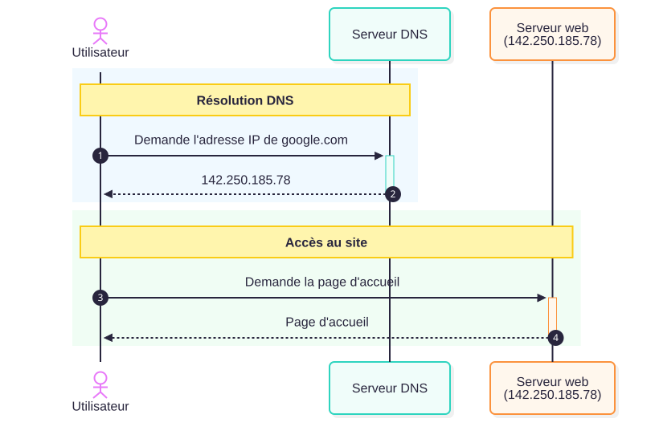
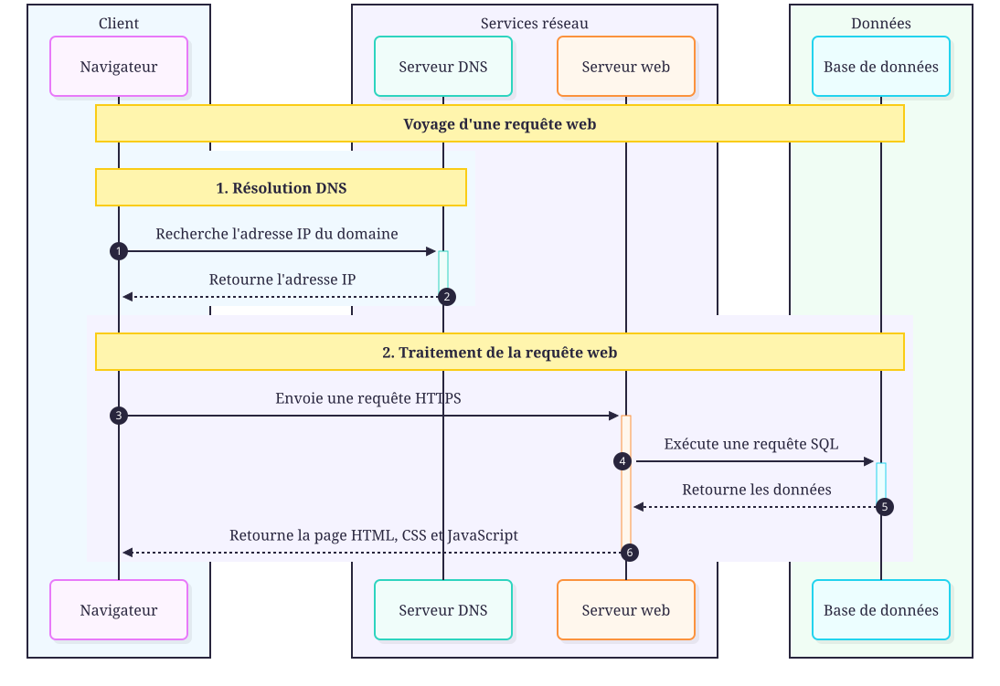

# Les réseaux

    Le réseau est ce qui permet aux ordinateurs de communiquer entre eux.
    Découvrez les mécanismes invisibles derrière chaque clic.

---

## Les serveurs

Les serveurs sont les machines qui **possèdent** les sites web et les
distribuent aux clients qui les demandent.

- Ils sont stockés dans des **datacenters** (immenses salles remplies de machines).
- Ils communiquent avec les clients via des **câbles réseau** (fibre optique),
  souvent enfouis **sous terre ou sous la mer**.

!!! info "Fait intéressant"
    Les câbles de fibre optique sous-marins relient les continents entre eux.
    C'est grâce à eux qu'on peut consulter un site hébergé aux États-Unis
    depuis la France en quelques millisecondes.

---

## Adresse IP et DNS

### Adresse IP

Chaque ordinateur connecté à Internet possède une **adresse IP**
(*Internet Protocol*) : une suite de nombre unique.

!!! example "Exemple d'adresse IP"
    `205.89.177.26` — c'est comme un numéro de téléphone pour un ordinateur.

### Nom d'hôte et DNS

On ne peut pas retenir des suites de chiffres. Les **noms d'hôtes**
(comme `google.com`) permettent de désigner un site de manière mémorable.

Le **DNS** (*Domain Name System*) est l'annuaire qui fait le lien entre
le nom d'hôte et l'adresse IP.

<figure markdown="span">
  { width="700" }
  <figcaption>Séquence DNS — résolution de nom de domaine en adresse IP</figcaption>
</figure>

!!! summary "Règle à retenir"
    Chaque serveur sur le Web a **une adresse IP** et **un nom d'hôte**.
    Le DNS traduit le nom en IP.

---

## Les protocoles

Les ordinateurs communiquent grâce à des **protocoles** :
des langages de communication standardisés.

### Protocoles bas niveau

| Protocole | Nom complet | Rôle |
|-----------|-------------|------|
| **TCP** | Transmission Control Protocol | Transport fiable de données (pages web, e-mails...) |
| **UDP** | User Datagram Protocol | Transport rapide mais non garanti (streaming, jeux en ligne) |

!!! warning "Vint CerF — le père d'Internet"
    TCP a été inventé par **Vint Cerf**, considéré comme le père d'Internet.
    Sans TCP, pas de communication réseau — et Tim Berners-Lee n'aurait
    jamais pu inventer le Web.

### Protocoles haut niveau

Ces protocoles forment une **surcouche** au-dessus de TCP :

| Protocole | Utilisation | Sécurisé ? |
|-----------|-------------|------------|
| **HTTP** | Échange de pages web | ❌ Non |
| **HTTPS** | Échange de pages web chiffrées | ✅ Oui (SSL/TLS) |
| **FTP** | Transfert de fichiers | ❌ Non |
| **SMTP** | Envoi d'e-mails | ❌ Non |

!!! tip "Toujours préférer HTTPS"
    Aujourd'hui, la quasi-totalité des sites utilisent **HTTPS**.
    Vérifiez toujours la petite icône 🔒 dans la barre d'adresse.

---

## Résumé : le voyage d'une requête web

<figure markdown="span">
  { width="800" }
  <figcaption>Voyage d'une requête web du navigateur au serveur en passant par le DNS</figcaption>
</figure>

!!! note "En résumé"
    1. Le navigateur interroge le **DNS** pour trouver l'adresse IP.
    2. Il envoie une requête **HTTP/HTTPS** au serveur.
    3. Le serveur génère la page (parfois avec une **base de données**).
    4. La page est renvoyée au navigateur qui l'affiche.
