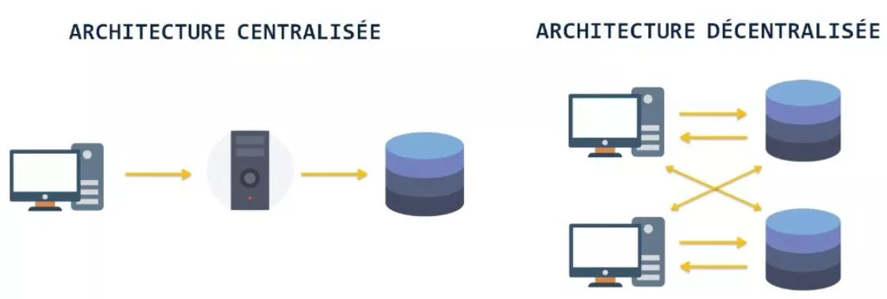
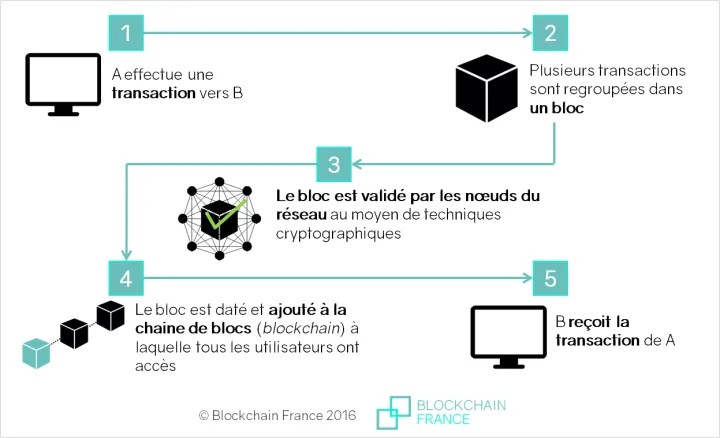
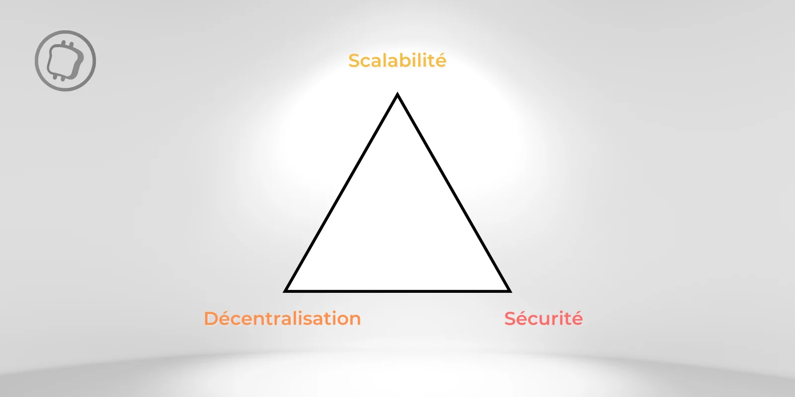

# Blockchain

    La blockchain est une technologie qui permet le stockage et la transmission d'information de manière transparente, décentralisée et sans tiers de confiance.

---

## Introduction

Développée à partir de 2008, elle est perçue comme étant **la seconde révolution d'internet**.

La Blockchain (chaîne de blocs) est, en premier lieu, une technologie de stockage et de transmission d'information.

---

## Technologie Blockchain

La blockchain représente une **séquence de blocs reliés les uns aux autres** dans laquelle chaque bloc correspond à un ensemble de transactions. Elle se définit comme une **base de données stockée sur un réseau décentralisé**.

!!! info "Informations"
    Cette base de données est immuable, c'est-à-dire qu'il est seulement possible de consulter et d'ajouter des informations sur cette dernière.

Contrairement aux systèmes bancaires traditionnels, **la blockchain se veut décentralisée**. Au lieu d'avoir une banque qui contrôle et valide les transactions, ce rôle est réparti sur un **réseau d'ordinateurs, appelés validateurs ou nœuds**. Chaque fois qu'une transaction est effectuée, elle doit être approuvée par ces ordinateurs selon des règles préétablies, ce qui assure la sécurité et l'intégrité des données.

> La blockchain peut être comparée à un grand livre de compte public et immuable.

Un livre où chaque mot représente une transaction qui doit être vérifiée et approuvée avant de pouvoir être écrite sur la page.

Dans le cas de la blockchain ***Bitcoin***, c'est le rôle des mineurs qui agissent comme des relecteurs. Ils examinent chaque mot pour s'assurer qu'ils sont bien orthographiés (que les transactions sont en règle). Une fois qu'un ensemble de mots est approuvé, ils sont inscrits de manière permanente sur une page (formant ainsi un bloc). Une fois que la page est pleine et que toutes les transactions sont vérifiées, elle est scellée et une nouvelle page est créée. **Ces pages sont ensuite liées les unes aux autres dans l'ordre chronologique**.

Dans une blockchain, chaque nouveau bloc (c'est-à-dire un ensemble de transactions) s'ajoute à la chaîne de manière séquentielle et irréversible, similaire à la façon dont chaque page d'un livre suit la précédente. **Cette technologie enregistre et compile l'historique complet des échanges réalisés entre les participants au réseau depuis sa création**, avec ces échanges organisés en une séquence de blocs sécurisés et interconnectés via la ***cryptographie*** par des ordinateurs.

Ces ordinateurs, aussi appelés **validateurs**, travaillent pour atteindre un consensus majoritaire, essentiel pour maintenir l'intégrité du réseau. Il existe 2 principaux mécanismes qui permettent d'assurer la sécurité et la validité des transactions sur les réseaux blockchain :

- Le Proof of Work (**PoW**)
- Le Proof of Stake (**PoS**)

---

### Proof of Work

Utilisé par Bitcoin, il requiert des mineurs pour résoudre des problèmes cryptographiques complexes. Cette méthode de consensus assure une **sécurité robuste mais plus consommatrice d'énergie**.

### Proof of Stake

Il attribue le droit de valider des transactions en fonction de la quantité de crypto détenue par un participant ce qui favorise une approche plus écologique. Cependant le ***PoS soulève des questions sur la centralisation*** potentielle du pouvoir entre les mains des gros détenteurs de jetons.

---

Une vulnérabilité majeure des blockchains est "***l'attaque des 51%***", où une entité contrôle plus de la moitié de la puissance de calcul et peut ainsi corrompre le réseau. Cependant cette vulnérabilité est à nuancer sur des grosses blockchains comme Bitcoin dans la mesure où **une telle opération est extrêmement complexe et coûteuse à mettre en place**.

Sur les plus petites blockchain, ce risque n'est toutefois pas à exclure. *Un exemple notable d'attaque des 51% fut celle sur Bitcoin Gold en 2018*.

Les avantages de la blockchain peuvent se résumer en 4 points :

1. ***La sécurité***: La blockchain utilise la cryptographie pour sécuriser les données, rendant les transactions immuables et à l'abri des falsifications.
2. ***La transparence***: Toutes les transactions sur la blockchain sont enregistrées de manière transparente et sont accessibles au public, ce qui permet une vérification et une traçabilité complète.
3. ***La décentralisation***: Au lieu de dépendre d'une autorité centrale (comme une banque), la blockchain répartit le contrôle entre de nombreux participants du réseau, réduisant ainsi le risque de corruption ou de défaillance d'un point central.
4. ***L'efficacité***: La blockchain permet en théorie des transactions plus rapides et moins coûteuses que les systèmes traditionnels, en éliminant les intermédiaires et en simplifiant les processus.

---

## Comment fonctionne une transaction sur la blockchain

[Vidéo - Comprendre la blockchain](https://www.youtube.com/watch?v=6uYRN6b5EMU&t=430s){ target="_blank" rel="noopener" }

Exemple concret avec la blockchain Bitcoin fonctionnant avec le consensus Proof of Work

**Une transaction est effectuée**, un transfert de BTC d'une `personne A` à une `personne B`. La signature numérique conditionne l'envoi de la transaction.

**La diffusion de la transaction dans le réseau** à tous les ordinateurs (ou nœuds) connectés au réseau de la blockchain. Ces nœuds reçoivent une copie de cette transaction. Ils vérifient et valident les détails de cette transaction à l'aide d'algorithmes.

**La création d'un nouveau bloc** a lieu. Elle correspond au regroupement de plusieurs transactions validées. Ce bloc inclut également un code cryptographique spécial, ***un hash***, qui le relie au dernier bloc de la chaîne, assurant la continuité et l'intégrité de la blockchain ainsi qu'un nouveau hash

**Minage** : Le processus de minage commence, où les mineurs utilisent leur puissance de calcul pour trouver un nouveau hash compatible avec le dernier bloc de la chaîne. Le mineur qui réussit à trouver ce hash ajoute le nouveau bloc à la chaîne et est récompensé sous forme de BTC. *Cette incitation financière est nécessaire pour encourager les mineurs à participer au fonctionnement de la blockchain*.

**Validation et mise à jour de la blockchain**: Une fois le nouveau bloc ajouté, la blockchain Bitcoin est mise à jour sur tous les nœuds du réseau. Chaque copie de la blockchain est identique, ce qui rend les données immuables et vérifiables par n'importe qui, à n'importe quel moment.

***Fonctionnement d'une blockchain***

---

## Les différents types de blockchain

**Il existe deux principaux types de blockchains**. Actuellement, les cas d'usage sont en grande majorité développés sur le premier type, celui des **blockchains publiques**.

### Les blockchains publiques

Les blockchains publiques sont le type de blockchain qui nous viennent intuitivement à l'esprit. **Ces chaînes de blocs sont entièrement accessibles et ouvertes à tous ce qui souhaite participer à la validation des transactions**. Elles offrent une transparence totale et fonctionnent sans autorité centrale, favorisant ainsi la décentralisation. Cependant, cette ouverture expose à des risques de sécurité, notamment l'attaque des 51%.

### Les blockchains privées

**Les blockchains privées sont gérées par une seule entité**, offrant confidentialité et rapidité des transactions, mais en omettant la décentralisation. Les nœuds sont simplement des points sur un réseau privé, et la blockchain est utilisée comme un registre distribué. Un cas d'utilisation répandue de blockchain privée est dans le secteur des institutions financières soumises à de fortes obligations de conformité aux réglementations.

Il existe aussi des sous types de blockchains privées nommées "**permissionnées**" et de "**consortium**" :

- Les blockchains permissionnées limitent l'accès à des utilisateurs spécifiques.
- Les blockchains de consortiums sont contrôlées par un groupe d'organisations, combinant la confidentialité et l'efficacité tout en maintenant un contrôle collaboratif.

---

## Le trilemme des blockchains

Le trilemme des blockchains aborde les défis de **sécurité**, **décentralisation** et une **scalabilité** auxquels font face ces dernières. La scalabilité se réfère à la capacité d'une blockchain à traiter efficacement un volume croissant de transactions et à s'adapter à une augmentation de la demande.

Il souligne que **les développeurs ne peuvent cumuler les 3 aspects évoqués au-dessus et doivent par conséquent faire des compromis**.
La blockchain Bitcoin est sécurisée et décentralisée mais peine en termes de scalabilité. À l'inverse, la **BNB Smart Chain** (BSC) allie scalabilité et sécurité, mais sacrifie la décentralisation.

Pour surmonter ce défi majeur, l'écosystème a vu l'émergence de **blockchains modulaires**. Il s'agit d'un type de blockchain qui repose non pas sur une seule couche, mais sur **plusieurs couches indépendantes**. Ce type de blockchain permet en théorie de surpasser le trilemme de la blockchain.

---

## Cas d'utilisation concret de la blockchain

### Un réseau de paiement infalsifiable

L'utilisation de la blockchain dans le système de paiements offre des avantages en **réduisant les coûts de transaction ainsi que la corruption**. Sa nature transparente et immuable permet de rendre impossible la falsification des enregistrements sur la blockchain. **Les transactions deviennent entièrement traçables et vérifiables**, ce qui empêche toute manipulation des montants transférés.

### Un renouveau pour la chaîne d'approvisionnement

La blockchain offre de nombreux avantages pour **la gestion de la supply chain (ou chaîne d'approvisionnement)**. Elle permet une meilleure transparence, car toutes les informations concernant les produits peuvent être **suivies et vérifiées en temps réel** par tous les acteurs de la chaîne, même le consommateur final.

La blockchain assure aussi une plus grande sécurité des données et réduit les risques de fraudes grâce à son système de chiffrement. Elle permet aussi **de réduire les coûts et les délais en automatisant certaines tâches et en éliminant les intermédiaires inutiles**.

### La révolution NFT permise grâce à l'immuabilité

Les **tokens non fongibles** (**NFT**) tirent parti de l'immutabilité de la blockchain. **Chaque NFT est unique et non interchangeable**. Grâce à la blockchain, **les informations concernant la création, la propriété et l'historique des transactions de chaque NFT sont enregistrées de manière permanente et transparente**, ce qui rend impossible la falsification ou la duplication.

---

## Quelles sont les limites de la blockchain

### Scalabilité et frais de transaction

Les blockchains peuvent rencontrer des difficultés à traiter un grand nombre de transactions simultanément, ce qui congestionne le réseau et entraîne une augmentation des coûts de transaction.

Pour l'instant, aucune blockchain majeure n'arrive à rivaliser avec la scalabilité d'un réseau de paiement comme **Visa qui est en capacité de traiter 24 000 transactions par seconde**.

### L'impact environnemental

**Les blockchains fonctionnant en Proof of Work (PoW) sont fréquemment sous le feu des critiques en raison de leur consommation énergétique élevée**. En effet, le processus de minage s'avère gourmand en électricité. Cette consommation énergétique est d'autant plus préoccupante lorsque la source d'énergie est non renouvelable

Actuellement, dans le cas du Bitcoin, cette électricité est principalement issue d'énergie renouvelable. **Selon les chiffres de l'université de Cambridge, la part des énergies renouvelables dans la consommation de Bitcoin représente plus de 37%**.

---

> Lien vers source: [cryptoast](https://cryptoast.fr/qu-est-ce-que-la-blockchain/){ target="_blank" rel="noopener" }
