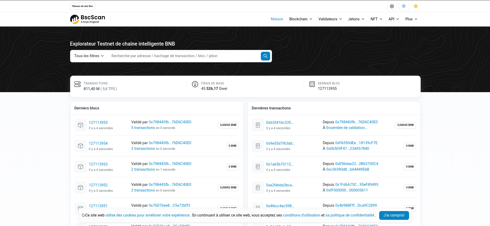

# BscScan

    Explorateur de blocs officiel de la BNB Smart Chain, permettant de suivre l'état d'avancement de ses transactions et d'inspecter les smart contracts.

---

## Qu'est-ce que BscScan ?

[BscScan](https://bscscan.com){ target="_blank" rel="noopener" } est le **BlockExplorer** de la ***BNB Smart Chain***.
Un BlockExplorer est **un moteur de recherche** qui permet à ses utilisateurs de chercher
facilement les transactions qui transitent sur la blockchain.

!!! info "Informations"
    BscScan est développé par la même équipe qu'Etherscan (l'explorateur de référence
    d'Ethereum) et reprend exactement les mêmes fonctionnalités, adaptées à la BNB Chain.

Il existe une version dédiée au réseau de test :
**[testnet.bscscan.com](https://testnet.bscscan.com){ target="_blank" rel="noopener" }** — c'est celle utilisée pour ce projet.

---

## Les fonctionnalités principales

### Rechercher une adresse

En collant une adresse de wallet ou de contrat dans la barre de recherche, on accède à :

- son solde en BNB et en tokens BEP-20 ;
- l'historique complet de ses transactions ;
- les tokens ERC-721 (NFT) qu'elle détient ;
- les interactions avec les smart contracts.

### Suivre une transaction

Chaque transaction possède un **hash unique** permettant de vérifier :

- son **statut** : en attente, réussie ou échouée ;
- le **bloc** dans lequel elle a été incluse et son horodatage ;
- les **frais de gas** payés ;
- les **tokens transférés** et les événements émis.

### Lire et interagir avec un smart contract

Sur la page d'un contrat, l'onglet **« Contract »** permet de :

- **Read Contract** : exécuter les fonctions de lecture (`balanceOf`, `totalSupply`…) ;
- **Write Contract** : envoyer des transactions (`transfer`, `mint`…) en connectant un wallet.

### Vérifier un contrat (Verify & Publish)

L'onglet **« Verify & Publish »** permet de publier le code source d'un smart contract.
BscScan le compile et compare le bytecode obtenu avec celui réellement déployé on-chain :
si les deux correspondent, le contrat affiche une coche verte ✅ et son code devient
consultable par tous.

!!! warning "Transparence"
    C'est un **gage de transparence essentiel** : n'importe qui peut
    vérifier ce que fait le contrat avant d'interagir avec lui.

### Consulter les informations d'un token

La page d'un token BEP-20 affiche son nom, son ticker, sa supply, le nombre de détenteurs
et son graphique de prix si celui-ci est échangé. Le bouton **« Update Token Info »**
permet au propriétaire du projet de publier le ticker, le site web et le logo du token.

---

## Application au projet GOLD42

C'est via BscScan Testnet que le token **GOLD42 (G42)** est consultable publiquement :

| Élément | Lien |
|---|---|
| Contrat G42 | [0xa3B9A3eb3F2aE8ed3a6788F4Ccbdb1e503FE6aaD](https://testnet.bscscan.com/address/0xa3B9A3eb3F2aE8ed3a6788F4Ccbdb1e503FE6aaD){ target="_blank" rel="noopener" } |
| Transaction de déploiement | [0x8646886e694e70d679d8bd5a46eb8429528b1ed63ae7288799f597d643ad830d](https://testnet.bscscan.com/tx/0x8646886e694e70d679d8bd5a46eb8429528b1ed63ae7288799f597d643ad830d){ target="_blank" rel="noopener" } |

On y retrouve notamment les événements émis par le contrat — `Mint`, `Burn`, `Transfer`,
`OwnershipTransferred` — ce qui rend le fonctionnement du token **entièrement traçable** :
chaque création, destruction ou transfert de G42 est public et vérifiable par tous.

---

> Lien vers source : [BscScan](https://bscscan.com){ target="_blank" rel="noopener" }
